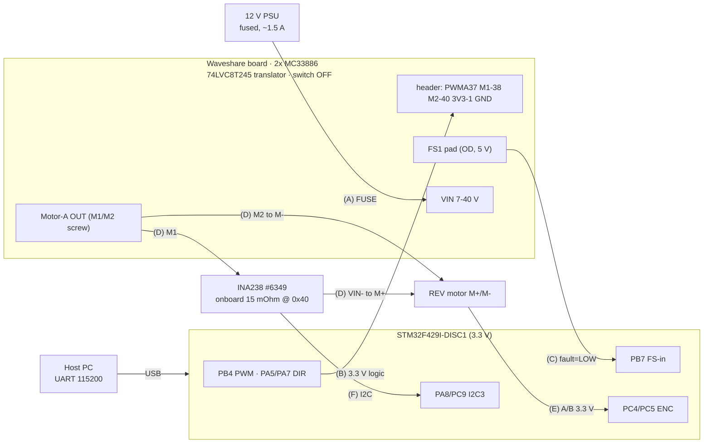

# WIRING — REV Core Hex Motor (block diagram)

Signal-flow map. **Authoritative pin/value details: [../WIRING.md](../WIRING.md) + [../SPECS.md](../SPECS.md).**
Wire only with power OFF. There are **6 cables (A–F)** — wire one at a time and tick it off.

Current sensing uses the **Adafruit INA238 breakout (#6349)** with an **onboard 15 mΩ 0.1% shunt**, so
there is **no external shunt** — the motor lead simply passes through the module's `VIN+ / VIN-`.

## The six cables (what connects to what)

```text
  (A) POWER     12 V PSU  ───────────────▶  Waveshare VIN (power screw terminal)
  (B) CONTROL   STM32     ───────────────▶  Waveshare 40-pin header  (PWMA, M1, M2, 3V3, GND)
  (C) FAULT     Waveshare FS1 pad  ──────▶  STM32 PB7
  (D) MOTOR     board M1 ▶ INA238 VIN+ ▶[onboard 15 mΩ]▶ VIN- ▶ motor M+   ·   board M2 ▶ motor M-
  (E) ENCODER   REV encoder (JST-PH)  ───▶  STM32  (PC4, PC5, 3V3, GND)
  (F) I²C       INA238 (STEMMA QT: SCL/SDA/VCC/GND)  ◀──▶  STM32 (PA8, PC9) @ 0x40
```

## Box diagram

```text
      Host PC ──USB (power + ST-LINK flash + UART 115200)──┐
                                                           ▼
   ┌────────────────────┐   (B) control 3.3 V    ┌──────────────────────┐
   │ STM32F429I-DISC1   │ ─────────────────────▶ │  Waveshare board     │ ◀─(A)── 12 V PSU
   │ 3.3 V, USB-powered │   (C) fault FS1 ◀────── │  2× MC33886, sw=OFF  │         (fused, ~1.5 A)
   └─┬─────────┬────────┘                         └──────┬───────────────┘
     │         │                                    (D)  │ M1          │ M2
     │ (F) I²C │ (E) encoder                              ▼             │
     │         │                              ┌──────────────────────┐ │
     │         │                              │ INA238  (inline)     │ │
     ├─────────┼─────────────────────────────▶│ VIN+ ▶[15 mΩ]▶ VIN-  │ │
     │         │                              │ SCL/SDA  (F)         │ │
     │         │                              └──────────┬───────────┘ │
     │         │                                  VIN- ▶ │ M+          │ M-
     │         │                              ┌──────────▼─────────────▼──┐
     │         └──────────────────────────────┤  REV Core Hex motor       │
     └────────────────────────────────────────┤  windings M+/M-           │
                              encoder (E) ─────┤  + quadrature encoder     │
                                               └───────────────────────────┘
```

`(D)` is the power path: board **M1** → **INA238 VIN+** → onboard 15 mΩ → **VIN-** → motor **M+**
(board **M2** → motor **M-**). The same INA238 talks I²C `(F)` to the STM32. One common ground throughout.

## Per-cable connection tables

### (A) Power — 12 V PSU → board
| From (PSU) | To (Waveshare power screw) | Note |
|---|---|---|
| `+12 V` (through **fuse**) | `VIN+` (7–40 V) | bench current-limit ~1.5 A |
| `GND` | `VIN-` | part of the single common ground |

### (B) Control — STM32 (3.3 V) → board 40-pin header  *(physical pin #)*
| STM32 | Signal | Board header pin |
|---|---|---|
| `PB4` (TIM3_CH1, ~20 kHz) | PWM enable | **PWMA = Pin 37** |
| `PA5` (GPIO out) | direction | **M1 = Pin 38** |
| `PA7` (GPIO out) | direction | **M2 = Pin 40** |
| `3V3` | translator ref (VCCA) | **3V3 = Pin 1** |
| `GND` | ground | **GND = Pin 34 or 39** |
> Power-select switch **OFF**. Do **not** wire the board's 5 V (Pin 2/4) to the F429.

### (C) Fault — board FS1 pad → STM32
| From | To | Logic |
|---|---|---|
| `FS1` pad (open-drain, 1k → **5 V**) | `PB7` (5 V-tolerant in) | idle = HIGH, **fault = LOW** → firmware trips PWM=0 |

### (D) Motor — board output → INA238 (inline) → motor  ⚠️ *board screw = OUTPUT, not the header*
| From (board Motor-A **OUTPUT screw**) | Through | To (REV motor JST-VH) |
|---|---|---|
| `M1` screw | **INA238 `VIN+` → onboard 15 mΩ → `VIN-`** | motor **M+** |
| `M2` screw | (direct) | motor **M-** |
> ⚠️ Board **M1/M2 SCREW = motor OUTPUT** vs **M1/M2 HEADER = direction INPUT** (cable B). Different pins.
> The motor reverses → INA238 reads **signed** current. PWM'd node = high CM dv/dt → use INA238 averaging.

### (E) Encoder — REV JST-PH (4-pin) → STM32
| JST-PH pin | Signal | STM32 |
|---:|---|---|
| 1 | Ch B | `PC5` (EXTI) |
| 2 | Ch A | `PC4` (EXTI) |
| 3 | 3.3 V | `3V3` |
| 4 | GND | `GND` |

### (F) I²C — INA238 breakout → STM32  *(no external shunt; onboard 15 mΩ)*
| INA238 (STEMMA QT / header) | To | Note |
|---|---|---|
| `SCL` | `PA8` (I2C3) | reuse board's I2C3 pull-ups (touch bus); ≤400 kHz |
| `SDA` | `PC9` (I2C3) | |
| `VCC` (Vin/3Vo) | `3V3` | module runs 3–5 V; 3.3 V here |
| `GND` | `GND` | common ground |
| addr jumpers | default → **0x40** | touch is 0x41, left idle |
> Firmware: **set ADCRANGE = 0 (±163.84 mV, up to 10 A)** — the ±40.96 mV / 2.75 A range clips at the
> 4.4 A stall (4.4 A × 15 mΩ = 66 mV). VBUS is read by the module internally — no separate wire.

## Direction / speed (quick ref)
| M1 | M2 | PWMA | Motor A |
|---:|---:|---|---|
| 1 | 0 | PWM | forward @ duty |
| 0 | 1 | PWM | reverse @ duty |
| x | x | 0 | coast / stop |

## Legend / gotchas
- **One common ground** ties PSU −, board, INA238, encoder, and STM32.
- **Switch OFF** so the board can't back-feed 5 V to the USB-powered F429.
- **M1/M2 collision:** board **screw = motor OUTPUT**, header **= direction INPUT**.
- **FS** is open-drain, pulled to 5 V (idle HIGH); fault pulls LOW → trip PWM=0.
- **INA238 onboard 15 mΩ** → no external shunt; use **ADCRANGE=0** for the 4.4 A stall.
- **Encoder is 3.3 V only** — never route 5 V/12 V to it.
- **Power-up order:** STM32 (USB) + idle **first**, then 12 V motor supply; power down in reverse.

## Renderable version (Mermaid)

